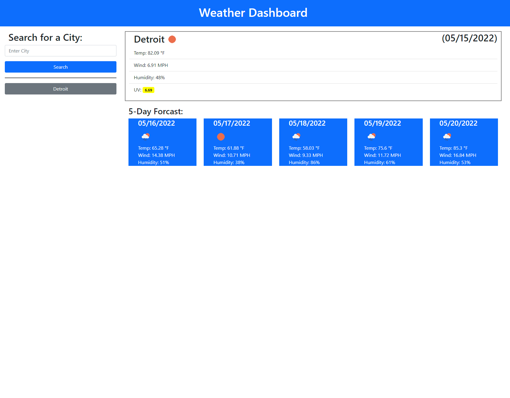

# City Weather Application

## Image of Site

## Deployed Site
[Weather Dashboard](https://cmskorcz.github.io/city-weather-app/)

## Purpose
The purpose of this project was to incorporate server-side APIs into an application in order to display data that is updated remotely. This was accomplished via fetch requests in JavaScript, which would then generate dynamically produced elements and text to the page.

## Description
This application displays the weather for a city ented into the search bar. The main display will show the current weather for the city searched, with the current date displayed in the corner. Below the main display is a basic 5-day forcast for the searched city. The application stores the clients previous searches in local storage, and will populate a search history. The elements in the search history can be clicked, which will then populate the weather fields with the selected city's forcast.